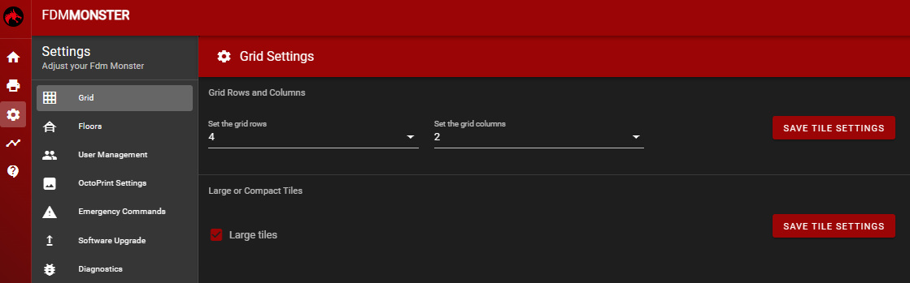
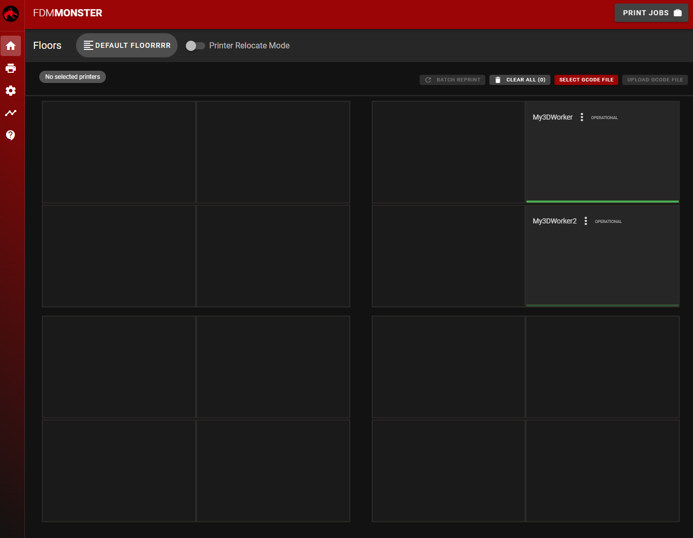

# Grid Settings

The grid settings influence how many printers are shown in the grid.
You can adjust the amount of rows and columns, as well as enable large tile mode.
Both types of settings can be changed on the fly, without restarting the server.

## Grid Rows and Columns

The amount of rows and columns can be adjusted by changing the values in the input fields.
The grid will automatically update to reflect the new values.

## Large Tile Mode

The large tile mode can be enabled by clicking the toggle button.
When enabled, the grid will show large tiles instead of small tiles.
In large tile mode, the grid will show fewer printers, but more information about each printer.

