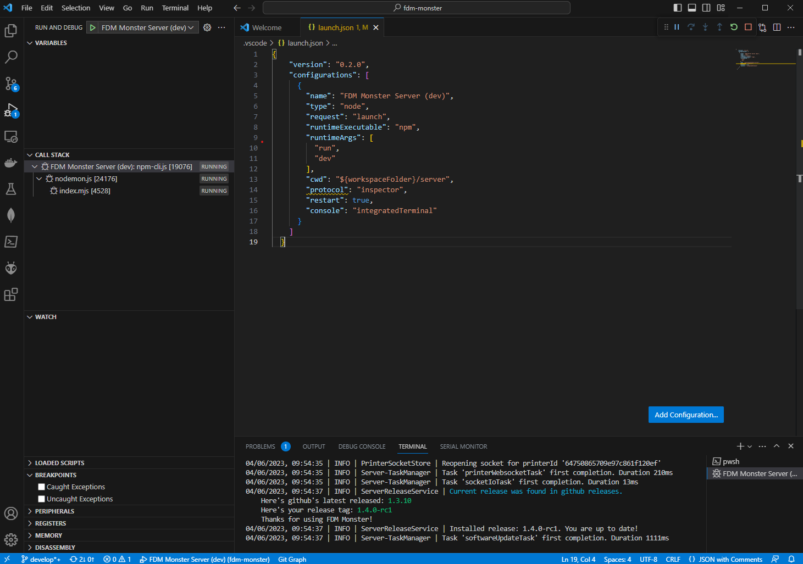
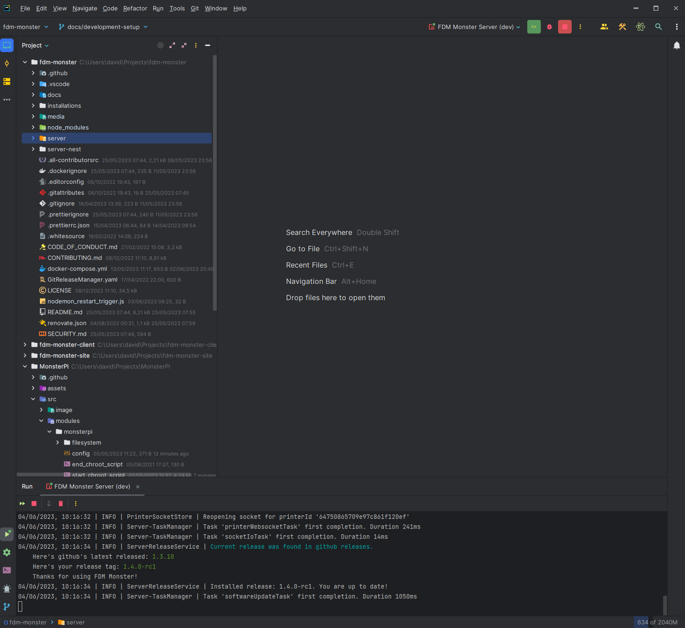

# FDM Monster Server Installation Guide

This guide will walk you through the process of setting up the FDM Monster server.
Please note that this chapter focuses on installing the server component only.
If you want to run the FDM Monster Vue project as well, please refer to
the [Client Installation Guide](./setup_client.md).

## Making Changes to FDM Monster

If you wish to contribute to the FDM Monster project and make changes to the codebase,
please follow the guidelines outlined in
the [CONTRIBUTING.MD file](https://github.com/fdm-monster/fdm-monster/blob/develop/CONTRIBUTING.md).
In summary, you should fork the repository, make your changes in a separate branch,
and create an issue before submitting a pull request.

## Prerequisites

Before you begin, ensure that you have the following tools installed on your system:

- Node.js 18 LTS
- Yarn 1.22.0 or higher
- MongoDB 5 or higher
- MongoDB Compass
- VS Code or WebStorm (your choice of IDE)

## Clone the Repository

To get started, clone the FDM Monster repository from GitHub. Make sure to clone from either the `develop` or `main`
branch:

```bash
git clone https://github.com/fdm-monster/fdm-monster.git
```

## Setting Up the Development Environment

1) Navigate to the cloned repository:
    ```bash
    cd fdm-monster/server
    ```
   
2) If yarn is not yet installed:
   ```bash
   npm install -g yarn
   ```
      
3) Install the dependencies using Yarn:
   ```bash
   yarn install
   ```
  
4) Configure the environment variables by creating a .env file in the project root directory.
   You can use the provided .env.template file as a template.

5) Start the MongoDB server and make sure it is running.

6) Launch the FDM Monster server:
    - VS Code: Create a run configuration that executes `yarn run dev` as the command. (Refer to the VS Code Run
      Configuration section below for detailed steps.)
    - WebStorm: Create a run configuration that executes `yarn run dev` as the command. (Refer to the WebStorm
      Run Configuration section below for detailed steps.)

7) Access the running server at http://localhost:4000 in your preferred web browser.

## VS Code Run Configuration

To create a run configuration in VS Code for running the FDM Monster server, follow these steps:

1) If the file ".vscode/launch.json" exists and looks alright, you can skip steps 2 to 4. Open VS Code and navigate to the "Run and Debug" panel.

2) Click on the link `create a launch.json file` to open the `launch.json` file. You should select Node.js as the type.
   If this does not work, you can manually create the file in the `.vscode` folder in the project root directory.

3) Paste the JSON script provided below into the launch.json file:
   ```json
   {
     "version": "0.2.0",
     "configurations": [
       {
         "name": "FDM Monster Server (dev)",
         "type": "node",
         "request": "launch",
         "runtimeExecutable": "yarn",
         "runtimeArgs": [
           "run",
           "dev"
         ],
         "cwd": "${workspaceFolder}/server",
         "protocol": "inspector",
         "restart": true,
         "console": "integratedTerminal"
       }
     ]
   }
   ```

4) Save the configuration and close the "launch.json" file.

5) In the "Run and Debug" panel, select "FDM Monster Server (dev)" from the dropdown.

6) Click on the "Start Debugging" button or press F5 to launch the server. Alternatively, you can click on the green
   play button or press Ctrl + F5 to launch the server without debugging.


_Example screenshot showing the VS Code setup in action._

## WebStorm Run Configuration

To create a run configuration in WebStorm for running the FDM Monster server, follow these steps:

1) Open WebStorm and go to the "Run" menu.

2) Click on "Edit Configurations..." to open the "Run/Debug Configurations" dialog.

3) Click on the "+" icon to add a new configuration and select "NPM" from the dropdown.

4) Provide a name for the configuration (e.g., `FDM Monster Server (dev)`).

5) Set the package.json to the one in the cloned repository server folder: "server/package.json".

6) Set the Command to `run`.

7) Set the Scripts to `dev`.

8) Set the "Node interpreter" to the appropriate Node.js executable (v18.14.2 at the moment of writing).

9) Under the "Environment variables" section, click on the "+" icon and add a variable with the name NODE_ENV and value
   development.

10) Click "OK" to save the configuration.

11) In the top-right corner of WebStorm, select the created configuration from the dropdown.

12) Click on the green play button or press Shift + F10 to launch the server without debugging. Alternatively, you can click on the green
    red bug button or press Shift + F9 to launch the server with debugging.


_Example screenshot showing the WebStorm setup in action._

## Next Steps

Congratulations! You have successfully set up the FDM Monster server.

The next step is to set up the FDM Monster client. Please refer to the [Client Installation Guide.](./setup_client.md).

In the future we will provide a chapter on how to set up OctoPrint instances with a virtual printer.
Secondly, we will provide instructions on how to create printer instances in FDM Monster or import them from YAML files.

[//]: # (In the next chapter, we will explain how to set up virtual OctoPrint instances with Docker.)

[//]: # (Stay tuned for further instructions on creating printer instances in FDM Monster)

[//]: # (using either YAML import or the client printer create dialog.)

