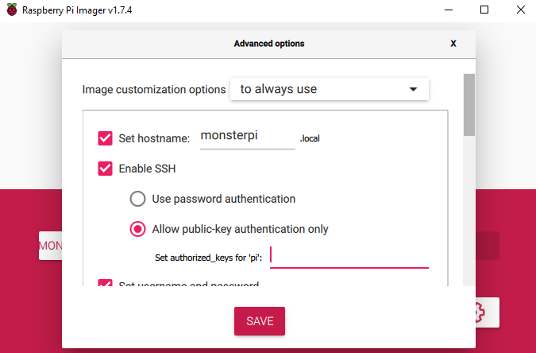

# Setting up MonsterPi

MonsterPi is a Raspberry Pi image built using CustomPiOS. The repository is [to be found
here](https://github.com/fdm-monster/MonsterPi).

This raspberry pi image includes FDM Monster and MongoDB. 

All versions can be downloaded from this Google Drive
folder: [Google Drive folder MonsterPi images](https://drive.google.com/drive/folders/1jyifNu2oPVpQkTYa4zwtYVvr0GKAjP94?usp=sharing)

## Latest Version - MonsterPi 0.2.0

**MonsterPi 0.2.0** can be downloaded from Google Drive: [MonsterPi 0.2.0 image](https://drive.google.com/file/d/1kBSJXcn7IROq-FrmCKkZLOrTXuiZC1Q6/view?usp=share_link). 
It ships with these contents: 

- MongoDB 4.4
- HAProxy (untested)
- FDM Monster 1.3.2

<details>
<summary>Older versions of MonsterPi</summary>

**MonsterPi 0.1.1** can be downloaded from Google Drive [MonsterPi 0.1.1 image](https://drive.google.com/file/d/1Dw66rziFuSCXACrRE-mUpuC0QAFY9WGs/view?usp=share_link)
It ships with these contents:
- MongoDB 4.4
- HAProxy (not setup yet)
- FDM Monster 1.3.1-rc2

**MonsterPi 0.1.0** can be downloaded with the
URL [Google Drive MonsterPi 0.1.0 image](https://drive.google.com/file/d/1a4DLk2Yy8uvyv9BskA073DdTLCI6w4UT/view?usp=share_link)
It ships with these contents:
- MongoDB 4.4
- HAProxy (not setup yet)
- FDM Monster 1.3.0

</details>

## Installing MonsterPi

Steps:

1) Download [Raspberry Pi Imager](https://www.raspberrypi.com/software/)

2) Insert a 16GB+ SD Card of high quality (class 10) and decent brand, **do not save money on this**!

3) Flash the image on the SD card. Do not forget to set the configuration (WiFi, SSH, hostname) according to your
   specifications: 

4) Insert the SD card into your Raspberry Pi 3 or 4 and power it up (with a recommended 5.1V power supply)

5) Visit [http://monsterpi.local:4000](http://monsterpi.local:4000) to access FDM Monster

6) Alternatively you can visit [http://monsterpi.local:80](http://monsterpi.local:80)
   or [https://monsterpi.local:80 (Self-Signed SSL Certificate)](https://monsterpi.local:80) to access FDM Monster

# Updating FDM Monster in MonsterPi 

I assume you know how to SSH into your MonsterPi. For me the following SSH entry (See `~/.ssh/config`) works well:
```
Host monsterpi
   HostName monsterpi.local
   User david
   # PasswordAuthentication true # I Do not like using passwords
   IdentityFile ~/.ssh/id_rsa_file # Replace with your SSH Key
   Port 22
```
Personally I like the [VS Code SSH extension](https://code.visualstudio.com/docs/remote/ssh) for this!

# MonsterPi Version 0.2.0+

```
# Change to pi user
sudo su pi

cd /home/pi/fdm-monster-daemon

# Deploy the fdm-monster server update
sudo bash ./update-fdm-monster.sh 
```

## Updating MonsterPi manually from 0.1.1 -> 0.2.0

This strategy allows you to stick with 0.1.1. I cannot recommend it in the long run however, because the image of 0.2.0
has changed quite a bit.

We will be downloading a gist from Github. You can also download the latest version of the file yourself
from [this Github URL](https://github.com/fdm-monster/MonsterPi/blob/main/src/modules/monsterpi/filesystem/home/pi/fdm-monster-daemon/update-fdm-monster.sh).

```
# Change to pi user
sudo su pi

cd /home/pi/fdm-monster-daemon

# Remove the existing (empty placeholder file in MonsterPi 0.1.1)
rm ./update-fdm-monster.sh
# Download new script
wget https://gist.githubusercontent.com/davidzwa/f0e094bd2223a0f1907009d576ad0b77/raw/4cf65be675dc09439873d504acf25abd32cda9c3/update-fdm-monster.sh

# Deploy the fdm-monster server update
sudo bash ./update-fdm-monster.sh 
```
