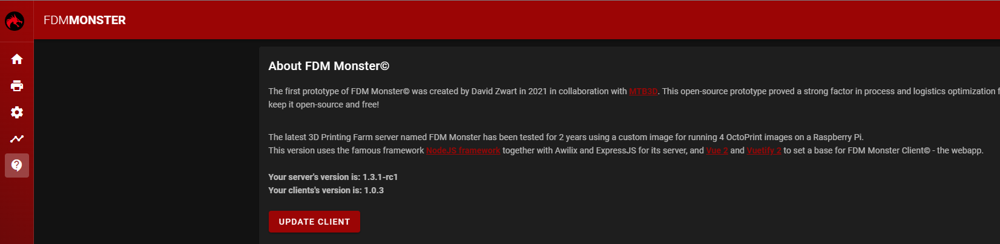

# Client Bundle

The client bundle is pushed to [Github Releases](https://github.com/fdm-monster/fdm-monster-client/releases) 
as well as [NPM package](https://www.npmjs.com/package/@fdm-monster/client). 

We add the bundle as a NPM package as an offline fallback for air-gapped installations. The bundle is immediately checked, downloaded and extracted from Github at startup.

## Triggering the update yourself

Click the **UPDATE CLIENT** button on the Help page to do this yourself.

After confirmation, the page will reload in about 5 to 10 seconds triggering the update to be presented to you.

