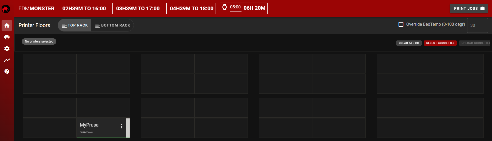

> :warning: **The installation on this page will be obsolete in FDM Monster 1.6.0! We need to document steps to install with Ansible still.**

# Linux Service
The scripts on this page are available in [installations/fdm-monster-node-linux](../../installations/fdm-monster-node-linux).


*This is the FDM Monster webapp after installation (visit [http://127.0.0.1:4000](http://127.0.0.1:4000))*

## Preparation of the Linux Service installation

Please ensure the following dependencies are installed and working:

- nodejs 18+
- git
- yarn (npm package)
- fdm-monster (github cloned source code)
- node-linux (npm package)

## Installation of the service

Please ensure that:

- You've cloned the repository
- Changed directory to [installations/fdm-monster-node-linux](../../installations/fdm-monster-node-linux)
- MongoDB 4.4+ has been installed
- `yarn` dependencies are installed in `fdm-monster/server/`
- `npm` dependencies are installed in `fdm-monster-node-linux/`

Please ensure the service is installed (executed inside `fdm-monster-node-linux`):

```shell
npm i
```

This will call `node ./install-fdm-monster.js` indirectly.

# Configuring server environment

The server has configuration options that allow changing how it operates. Warning, wrong configuration might cause the
server unable to correctly startup.

Each configuration change requires you to run the update script:

```shell
npm i
```

Please read the [Environment configuration](../configuration/preconfiguration.md) section for adjusting the `.env` file.

# Updating the server

The server is easily updated with the provided script `update-fdm-monster.sh`.
You will need to run this with elevation:

```bash
sudo bash ./update-fdm-monster.sh
```
