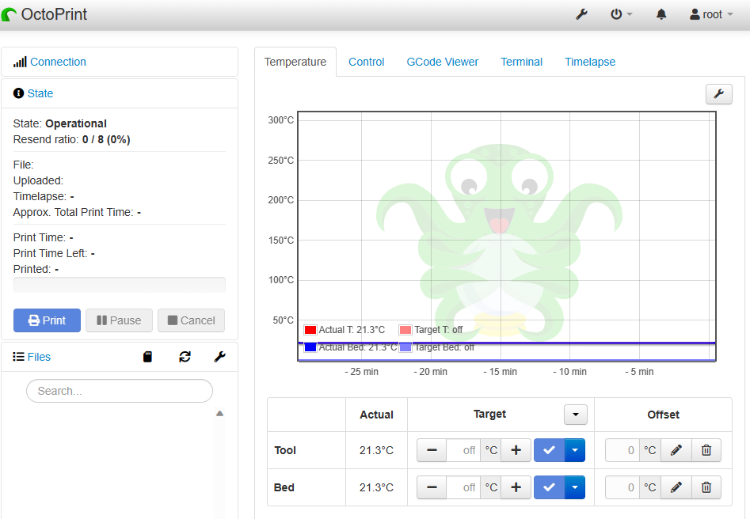
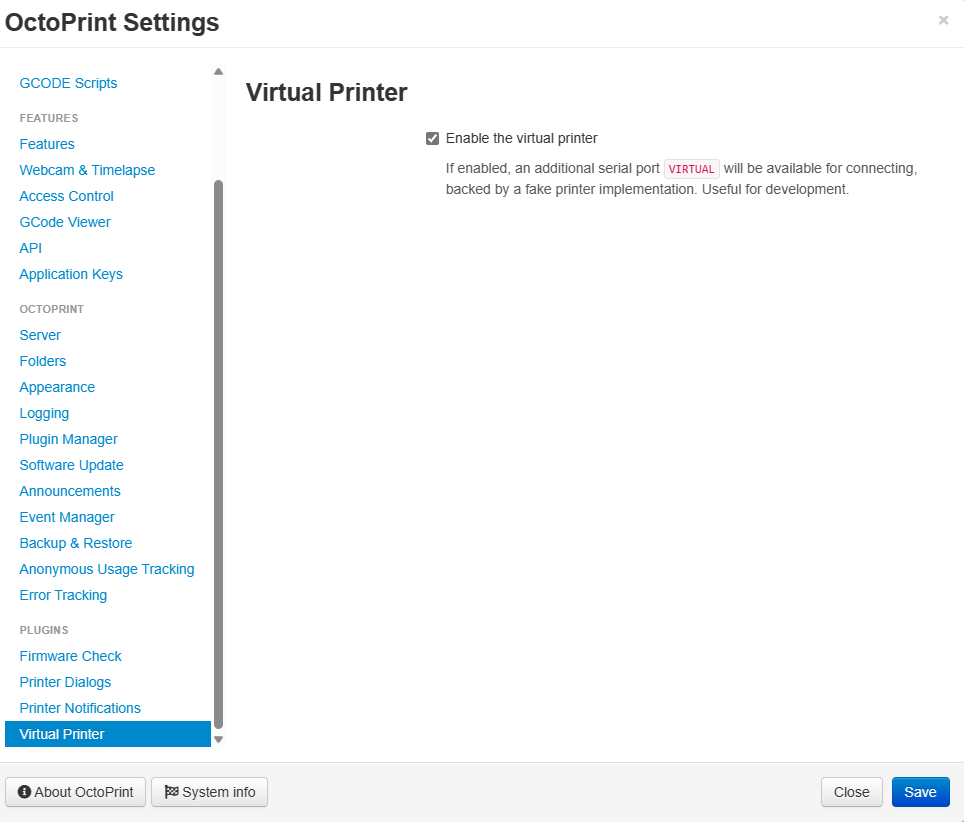
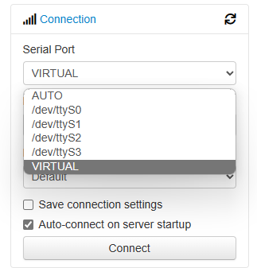
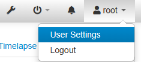
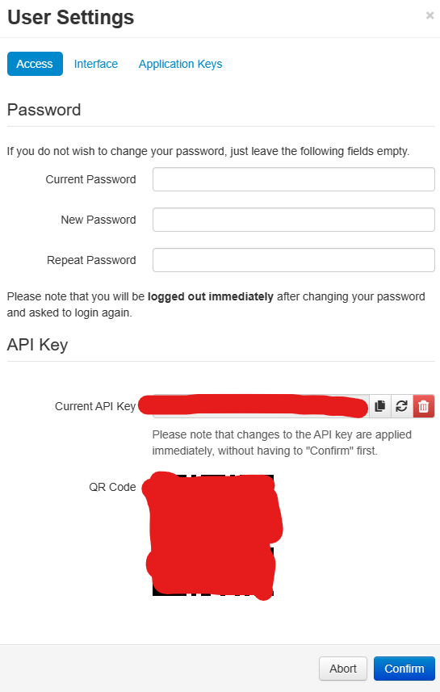
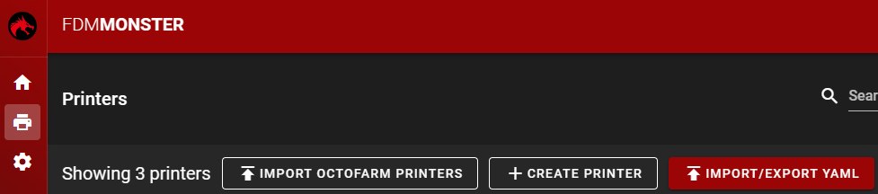
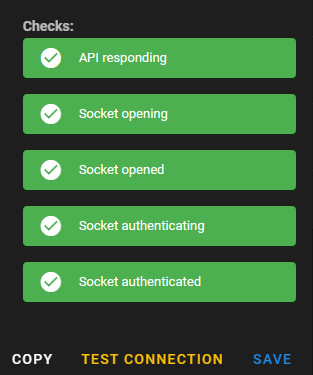
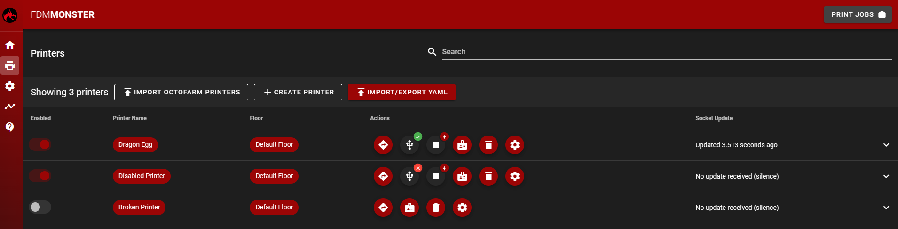

# Creating Printers

This is a guide on how to create new OctoPrint printers in FDM Monster. The guide assumes you have already installed FDM Monster and have a running instance.
Also, it is assumed you have MongoDB running on the same machine as FDM Monster (see [installations](../installations/installations.md)).

## Prerequisites

It is assumed that you have a running OctoPrint instance with at least one printer attached via a USB cable.
There are multiple approaches to setting up OctoPrint instances themselves, but this is outside the scope of this guide. 
It's recommended to deploy OctoPrint using the information on [OctoPrint downloads](https://octoprint.org/download/). 
Specifically it's common practice to run OctoPrint from a Raspberry Pi 3/4 using the [OctoPi](https://octoprint.org/download/#octopi) image.

For more information about OctoPrint itself, please check [OctoPrint documentation](https://docs.octoprint.org/en/master/).

Some things to note:
- Think about how USB ports are named on your system. If you have multiple printers, you might want to look at `udev` rules to make sure the same printer is always connected to the same USB port.
  - Here are possible helping sites to refer to [TheGeekDiary](https://www.thegeekdiary.com/beginners-guide-to-udev-in-linux/) and [Debian udev](https://wiki.debian.org/udev)
  - This is a device remapping rule based on its physical port: `SUBSYSTEM=="tty", OWNER="YOUR_USER", ATTRS{manufacturer}=="YOUR_MANUFACTURER", ATTRS{devpath}=="UDEV_PORT", SYMLINK+="op0"`
  - An example for a Prusa on USB port 1.1: `SUBSYSTEM=="tty", OWNER="PI", ATTRS{manufacturer}=="Prusa Research (prusa3d.com)", ATTRS{devpath}=="1.1", SYMLINK+="op0`
  - You can find the manufacturer by using `udevadm info ...` and looking for the `ATTRS{manufacturer}` attribute.
  - It's advised to blacklist the original `/dev/ttyUSB*` devices in OctoPrint Serial settings to avoid confusion with the new devices that will appear in /dev (for example `/dev/op0` should be used, not `/dev/ttyACM0` or `/dev/ttyUSB0`).
- It is possible to run multiple OctoPrint's on one Raspberry Pi. It's advised to take a look at [OctoPrint Deploy](https://octoprint.org/download/#octoprint_install--octoprint_deploy-linux).
- If you have more knowledge, you can also run OctoPrint in a Docker container. This is outside the scope of this guide.
- If you have the OctoPrint instance running on a different machine, you can still use FDM Monster. You will need to make sure that the OctoPrint instance is reachable from the FDM Monster machine.
  - This can be done by using a reverse proxy (for example [HAProxy](https://www.digitalocean.com/community/tutorials/an-introduction-to-haproxy-and-load-balancing-concepts), [NGINX](https://docs.nginx.com/nginx/admin-guide/web-server/reverse-proxy/)) or by using a VPN (for example [WireGuard](https://www.wireguard.com/)).
  - Alternatively, you can also use a [SSH tunnel](https://www.ssh.com/academy/ssh/tunneling/example) to forward the OctoPrint port to the FDM Monster machine.
  - It is possible to use a specific/static IP address to reach the OctoPrint instance. You can look it up with `ifconfig` or `ip addr` on the OctoPrint host. 
  - Finally, you can use fully-qualified domain names (FQDN) to reach the OctoPrint instance. For example, if you have a `octopi.local` pointing to the OctoPrint instance, you can use this domain in FDM Monster.

## Preparing the OctoPrint instance

Before you can add a printer to FDM Monster, you need to make sure that the OctoPrint instance is ready to be used by FDM Monster.
This means you need to have completed the OctoPrint setup wizard and have at least one printer connected to the OctoPrint instance.

_OctoPrint dashboard with a printer connected._

### Completing the OctoPrint setup wizard

When you first start OctoPrint, you will be greeted by the setup wizard. This wizard will guide you through the initial setup of OctoPrint.
It is recommended to complete this wizard before continuing with this guide.

### Setting up a Virtual printer (Optional)

If you don't have a physical printer, you can also use a virtual printer. This is a printer that is not connected to a physical printer, but can be used to test FDM Monster.

_To create a virtual printer, you can use toggle the Virtual Printer option in the OctoPrint settings._

### Setting up a USB printer

After completing the setup wizard, you will be greeted by the OctoPrint dashboard. This dashboard will show you the status of your printer.

_OctoPrint dashboard with possible available USB connections._

### Get the API Key

To be able to connect to the OctoPrint instance, you will need to get the API key. This key can be found in the User settings.

Click the User Settings in the user menu.

Now prepare the following things
- Copy the API key to be used in FDM Monster.
- Copy the IP address or FQDN host name of the OctoPrint instance. This can be found in the browser URL bar.
- Copy the port of the OctoPrint instance. This can be found in the browser URL bar. If no port is shown you can assume it is `80` (http, default) or `443` (https).

## Adding the printer to FDM Monster

Now that you have a running OctoPrint instance, you can add it to FDM Monster. To do this, you need to go to the Printers page in FDM Monster.

Click the Create Printer button to open the printer creation dialog.

Fill in the printer details:
- The name is the name that will be shown in FDM Monster.
- The IP/Host is the IP address or FQDN host name of the OctoPrint instance.
- The Host Port is the port of the OctoPrint instance.
- The API Key is the API key you copied from the OctoPrint instance. 

### Testing the connection

Test the connection by clicking the Test Connection button in the printer dialog. If the connection is successful, you will see a green messages appear on the right.
If the connection is unsuccessful, you will see a red alerts appear.

In case of an unsuccessful connection, please check the details you entered.
Can't resolve the issue? Please contact us on [Discord](https://discord.gg/mwA8uP8CMc).

### Creating the printer

Press the Create button to create the printer. If the printer has been created successfully, the printer will be shown in the printer list.

_The printer list with three newly created printers._

