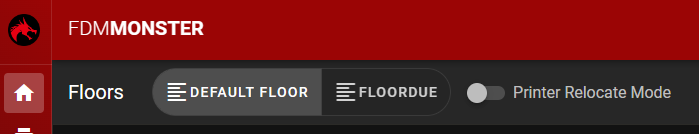
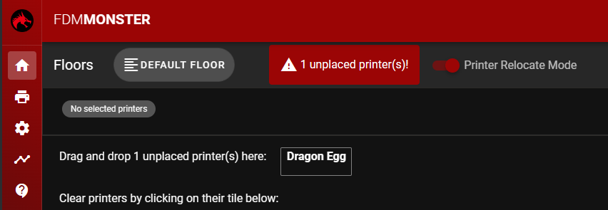

# Organizing Floors

The FDM Monster webapp uses a concept of floors to group printers together. This allows you to organize your printers in a logical way.
Of course all farms are different, so you can organize your printers in any way you want.

## Creating a floor

A default floor is created when you first start the FDM Monster webapp. You can stick with this floor, or create a new one in the Floor settings.

## Adding printers to a floor

You can add printers to a floor with drag and drop. In order to do this, you need to enable the Printer Relocate Mode. This can be done by toggling the Printer Relocate Mode switch in the top bar of the home page.

_Printer Relocate Mode toggle._

Printer Relocate Mode is now enabled. You can now drag and drop printers to a floor position.

## Removing printers from a floor

You can remove printers from a floor by dragging them out of the floor. This will not delete the printer, but only remove it from the floor.

To delete a printer, you must enable the Printer Relocate Mode. This can be done by toggling the Printer Relocate Mode switch in the top bar of the home page.
Now click on the printer you want to delete, and it will be deleted from that floor.

