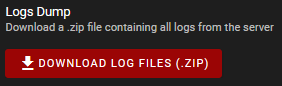

# Troubleshooting
{: .no_toc }

## Diagnostics

Sometimes things go wrong. This section contains information about how to diagnose and report problems.

### Logging
The FDM Monster webapp has a diagnostics page that can be used to download the log files. These log files contain
information about the FDM Monster webapp, and can be used to diagnose problems. Usually, the developers will ask you
to send them the log files when you report a problem. This allows them to fix bugs and improve the software. Note that
the logs might contain personal information, such as your username or printed file names. 
If you do not want to share this information, you can remove it from the log files before sending them to the developers.

* **Downloading the log dump ZIP - webapp**
  * Open the FDM Monster webapp in your browser.
  * Click on the `Settings` navigation link
  * Click on the `Diagnostics` setting page
  * Click on the `Download log files (.ZIP)` button

  
  
  _The `Diagnostics` settings page with log dump button._

* **Downloading the log dump ZIP - direct download**
It is possible to download the log dump ZIP file directly, without using the FDM Monster webapp. This can be useful if
the FDM Monster webapp is not working. 
    * Open your browser.
    * Navigate to the following URL: `http://<your-server-ip>:<your-server-port>/api/server/dump-fdm-monster-logs`
    * Replace `<your-server-ip>` and `<your-server-port>` of your FDM Monster server. For example: `http://monsterpi.local:4000/api/server/dump-fdm-monster-logs` 
    * Save the ZIP file to your computer

### Sentry
The FDM Monster webapp has a diagnostics page that can be used to configure Sentry diagnostics.
Sentry is a service that collects errors and warnings from the FDM Monster webapp and sends them to the developers.
This allows the developers to fix bugs and improve the software. Note that this is an opt-in feature, and that
you can disable it at any time. Also note that no personal information is sent to Sentry.

_Tick or untick the checkbox and press save to enable or disable Sentry._

### Reporting bugs
If you find a bug, please report it to the developers. You can do this by creating an issue on the GitHub repository.
Please include as much information as possible, such as the log files and screenshots. This allows the developers to
reproduce, trace down and fix the bug as quickly as possible.

Go to the [FDM Monster GitHub repository](https://github.com/fdm-monster/fdm-monster/issues) to create an issue.
